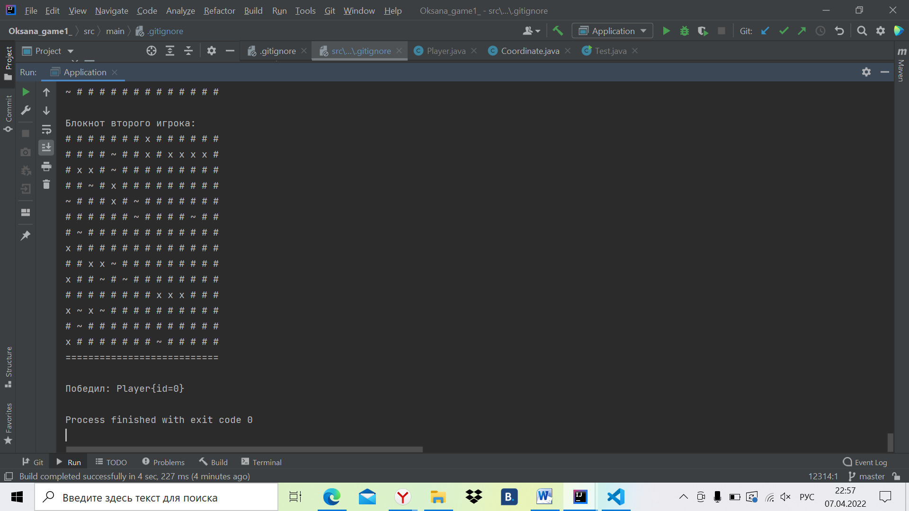

# Мой первый репозиторий на GitHub
___
__Краткая инструкция, как я создавала свой первый репозиторий на GitHub:__

1.Открыла в Idea проект игры Морской бой
2. В терминале выполнила команду _git init_
3. Затем создала 2 файла  _.gitignore_ : один-в корневой папке, второй-в папке самой игры и закинула туда файлы, которые не должны попасть в открытый доступ 
4. Выполнила команду _git add ._
5. Заккомитила файлы, не попавшие в  _.gitignore_ 
6. Запушила изменения
7. Репозиторий готов!
8. Создала README.md файл
9. Запушила изменения
10. Готово!

___
 ## Скрин запущенного приложения:

 
